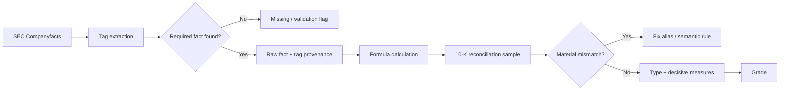

# Independent audit of the fundamental-analysis card system

This is one external-review answer, kept as the reviewer wrote it. It is not a rule change. After it was written, the roadmap decided two things this answer argues against or leaves open: cap PEG growth at 25%, and subtract stock comp from free cash. Those decisions are in `docs/YOL_HARITASI_v2.md`, not in this file.

Names follow `docs/GLOSSARY.md`. Where a result is what the trial code printed, the code's label is in parentheses.

## Executive summary and main findings

I did the review from the trial rules the user uploaded, the Appendix A results, the Appendix B raw figures, and the Appendix C Python code. I recomputed the computable metrics for all 10 companies from the rounded figures in Appendix B, and I compared them line by line with the SEC 10-Ks, starting with Coca-Cola, NVIDIA, and Nike. fileciteturn0file0

**Main result:** the skeleton of the grading mechanism is more solid than I expected. I did not see a basic coding error in how the thresholds were put into code, in the mark logic, in the debt-combination rule, or in the grade-decision algorithm. But **there is a critical error in the data layer: "cash + short-term investments / liquid assets" is pulled badly short for some companies.** At Coca-Cola this error does not change only one figure. Under the current rules it changes the final grade.

In Coca-Cola's 2025 10-K, cash is **$10.270 billion**, short-term investments are **$3.602 billion**, and the total is **$13.872 billion**. The trial data used $10.27 billion as "cash + short-term investments". citeturn14search0turn14search7 With this correction, years to repay debt fall from about **5.3 years to 4.8 years**, so ❌ becomes ➖. Interest cover is already ✅, so the combined Debt measure becomes ✅ instead of ➖. The slow-grower decision set becomes `[✅, ➖, ➖, ✅, ✅]`: no red, and three of the five decisive measures are green. **The system's own rules make Coca-Cola solid (`SAĞLAM`) in that case.** This matters because it shows the effect of a data error on the grade. It is not a reason to bend the rule so that "KO must be mid".

The second main problem is the `missing = 0` approach. If capex is not found it is treated as zero, a missing year in the three-year free cash flow is treated as zero, a missing liquid-asset component is treated as zero, and a missing dividend is treated as zero. This makes "no data" the same thing as "the real economic value is zero". In a card system that runs on its own, that produces false certainty.

The third main problem is in the company-type logic: **the `fast_grower` test runs before the `unprofitable` test.** So Rivian, which produced an operating loss in all five years, becomes a `fast_grower` because revenue grew. That drifts from Lynch-inspired type logic and from the system's "quality first" aim. Fundsmith's own investment criteria clearly put first a high operating ROCE, a return that turns into cash, and businesses that do not need extreme leverage. A loss-making company skipping the quality filter on revenue growth alone does not fit that philosophy. citeturn15search10turn15search3

### Findings

| # | Kind | Where | Issue | Evidence | Severity | Simplest fix | How I know |
|---|---|---|---|---|---|---|---|
| 1 | **data / grade** | **KO, liquid assets → M7 → Debt → grade** | Appendix B shows 2025 liquid assets of **$10.27bn**. Cash + short-term investments are really **$13.872bn**. Under the current rules this error moves KO from mid (`ORTA`) to solid (`SAĞLAM`). | 10-K: cash $10.270bn + short-term investments $3.602bn = $13.872bn. Operating cash flow $7.408bn, capex $2.112bn. citeturn14search7turn21view2turn21view3 | **High** | Do not treat liquid assets as complete before `ShortTermInvestments` is actually caught. Fix the KO alias. | **Verified against the source + recomputed** |
| 2 | **data** | **NVDA, liquid assets / ROCE** | Appendix B FY2026 liquid assets **$10.61bn**. That is almost only cash. In the 10-K, cash + marketable securities are **$62.556bn**. | Cash $10.605bn, marketable securities $51.951bn. citeturn23search0turn24view1 | **High** | Add `MarketableSecurities` / the right current marketable-security tags to the liquid-investment alias list. | **Verified against the source** |
| 3 | **data** | **NKE, M6–M7** | Appendix B liquid assets **$7.56bn**. In the 10-K, cash $7.563bn + short-term investments $1.464bn = **$9.027bn**. Debt is $7.942bn, so M6/M7 should be **"cash > debt"**, not a numeric ratio. | NIKE balance sheet and debt note. citeturn19view1turn19view2 | **Medium** | The same liquid-asset fix. | **Verified against the source** |
| 4 | **data** | **PFE, liquid assets / M7 / ROCE** | Appendix B liquid assets **$10.32bn**. The 2025 10-K has cash $1.142bn + short-term investments $12.454bn = **$13.596bn**. | Pfizer's balance sheet reports the two lines directly. citeturn18search2turn18search5 | **Medium** | Add Pfizer's investment tag to the alias list and reconcile the total. | **Verified against the source** |
| 5 | **code / data** | `likit = nakit.get(e,0) + kvy.get(e,0)` | A missing short-term-investment fact is automatically counted as **zero**. This behavior is the shared root of the KO/NVDA/NKE/PFE errors. | Appendix C code + comparison with four 10-Ks. SEC Companyfacts aggregates only the fitting non-custom taxonomy facts. Companies can use extension/custom tags. citeturn20search3turn20search0 | **High** | Separate "not found" from 0. Store the component source of the liquid total. If a component is missing, raise a validation flag. | **Code review + source** |
| 6 | **code** | `fcf = on[e] - yat.get(e, 0)` | If capex is not found, free cash flow is overstated. In the NVIDIA 2021 example, Appendix B shows capex as "—" but free cash flow was set equal to operating cash flow. | The code explicitly uses `yat.get(e,0)`. | **High** | If capex is missing, **free cash flow = None**. Use zero only when the real 10-K value is actually zero. | **Code review / reasoning** |
| 7 | **code** | `fcf3 = sum(fcf.get(e,0) ...)/3` | A missing free-cash-flow year is treated as 0 and the sum is always divided by 3. M7 and M10 can go wrong. Cash conversion can also treat a missing free cash flow as 0 indirectly. | The code line does this directly. | **High** | If all three years are not there, mark the 3-year free-cash-flow metric `not_computed`. | **Code review** |
| 8 | **code** | operating-income fallback | `faal[e] = vo[e] + (faiz.get(e) or 0)` assumes "interest = 0" when interest is missing, and turns pre-tax income into operating income. | Appendix C. | **Medium-high** | Run the fallback only when both pre-tax income and a fitting **accrual interest** figure exist. Otherwise None. | **Code review** |
| 9 | **rule / data** | **NKE operating income** | `pre-tax + interest expense` is not an economically reliable reconstruction of operating income. For NIKE 2026 the system computes about $4.22bn. The company's income statement shows gross profit $19.911bn and selling and administrative expense $16.114bn, so the pure operating spread is about **$3.797bn**. EBIT in NIKE's own ROIC table is **$3.850bn**, not $4.22bn. | NIKE's 2026 10-K income statement and ROIC disclosure. citeturn17search2 | **Medium-high** | In version 1, if `OperatingIncomeLoss` is missing, leave operating income `not_computed` unless a reliable statement reconstruction is done. | **Verified against the source + reasoning** |
| 10 | **code** | `faiz` synonym list | The last option is `InterestPaidNet`. That can feed a cash-flow item into M6 and into the operating-income fallback as if it were accrual interest expense. At NIKE in 2026, cash interest is about $323m while the income statement shows **net interest income of $50m**. | NIKE cash-flow statement and income statement. citeturn19view3turn17search2 | **High** | Take `InterestPaidNet` out of the M6/M3/M4 calculations. Keep it separate, for information only. | **Source + code review** |
| 11 | **code** | T and M5 | `tem.get(e,0)` and `net.get(e,0)` can treat partly missing data as zero. That can misstate dividend cover or cash conversion. | Appendix C. | **Medium-high** | If a fact is missing, treat the metric as missing. "Actually 0" is a separate case. | **Code review / reasoning** |
| 12 | **rule** | **RIVN type** | Because `fast_grower` is checked after `cyclical`, Rivian, with an operating loss in 5 of 5 years, becomes a `fast_grower` on a +48% revenue CAGR. The `unprofitable` check is never reached. | Appendix A/B/C. | **High** | Order: `cyclical` sector guard → `unprofitable` → `fast_grower` → …. Rivian is still weak (`ZAYIF`). It is only judged from the right type. | **Recomputed + reasoning** |
| 13 | **rule** | INTC/BA type | The rule "if the last 5 years contain both positive and negative operating income, the company is cyclical" can also mark distress/turnaround companies as cyclical. Turnarounds are already out of scope. | Intel and Boeing enter `cyclical` for this reason. | **Medium-high** | Outside Energy/Materials, run a turnaround/`unprofitable` guard first on mixed-sign companies. | **Reasoning** |
| 14 | **missing** | Appendix B / M4 ROCE | Appendix B does not show the `income tax` that ROCE needs. So the 10 ROCE figures in Appendix A **cannot be reproduced one for one from Appendix B alone**. | The M4 formula needs tax expense. Appendix B has no tax row. | **Medium** | Add `Income tax expense` and the tax rate used to the acceptance-test export. | **Tried to recompute from Appendix B** |
| 15 | **rule / code** | debt extraction | In the first debt group, as soon as **any** member is found the group is summed and the code `break`s. If a current/noncurrent piece is missing, a later group may never be tried. Overlap between groups is not checked either. | The `borc()` function. In the KO/NVDA/NKE/PFE cases I checked, I did not find a large error in the main debt totals. | **Medium** | Produce more than one candidate debt total. If they disagree, raise a validation flag. Do not blindly take the first group. | **Code review; partly verified against the source on the trial companies** |
| 16 | **missing / data architecture** | `us-gaap` Companyfacts only | SEC lets companies use a custom extension tag when no fitting standard element exists. The Companyfacts API says it aggregates non-custom taxonomy facts. So a standard-tag-only approach can treat a real line as "missing" at some companies. | SEC XBRL/API documentation. citeturn20search0turn20search3 | **Medium** | In version 1, do not try to resolve all custom XBRL. When an important fact is missing, say "manual/10-K validation required". | **Official SEC source** |
| 17 | **code / price** | `fv = r["fcf"].get(son,0)/pd` | If the latest-year free cash flow is missing, the free-cash-flow yield is shown as **0%**. It should be `not_computed`. | Appendix C `fiyat.py`. | **Medium** | A None check, instead of `.get(...,0)`. | **Code review** |
| 18 | **rule / price** | PEG | Growth in the denominator is the company's total net-income growth, against a per-share P/E. Buybacks and dilution are not in it. At extreme growth, NVDA's 0.15 is mechanically attractive and analytically meaningless. | Appendix A/C; NVDA FY2026 net income $120.067bn. citeturn24view2 | **Low** | For the price line, use diluted EPS CAGR. Cap or flag growth above 25% as "high growth — PEG has limited meaning". | **Code + reasoning** |

## Calculation check and 10-K data check

### Recomputation from Appendix B

I recomputed M1, M2, M3, M5, M6, M7, M8, M9, M10, and T from the rounded Appendix B figures **for all 10 companies**. I could not fully recompute M4, because Appendix B does not give income-tax data. Aside from rounding, the values below largely confirm Appendix A.

| Company | M1 revenue | M2 margin gap | M3 op. margin | M5 cash conv. | 3y avg FCF | M6 / M7 | M8 share count | M9 GP growth | M10 | Versus Appendix A |
|---|---:|---:|---:|---:|---:|---|---:|---:|---|---|
| KO | 3.69% | +1.50 pt | 28.70% | 57.45% | $6.60bn | 8.34× / 5.33y | −0.23% | 5.72% | FCF+ | **Arithmetic is right; liquid assets in the input are wrong** |
| NVDA | 100.06% | +2.93 pt | 60.38% | 82.87% | $61.52bn | cash>debt | −2.33% split-adj. | 115.38% | FCF+ | **Matches** |
| NKE | −3.24% | −1.03 pt | 9.09%* | 100.33% | $4.02bn | 13.19× / 0.09y* | −7.96% | −3.69% | FCF+ | Arithmetic matches; *source/liquid-asset problem |
| SBUX | 4.86% | −6.14 pt | 7.91% | 96.92% | $3.15bn | 5.44× / 4.00y | −3.55% | — | FCF+ | **Matches** |
| PFE | −14.80% | +7.82 pt | 16.28%* | 132.25% | $7.90bn | 3.82× / 6.88y* | +1.44% | −11.38% | FCF+ | Arithmetic matches; *liquid-asset data wrong |
| INTC | −5.71% | −6.33 pt | −4.18% | — | −$11.63bn | −2.03× / FCF− | +7.04% | −11.89% | 3.22y | **Matches** |
| BA | 10.33% | +0.41 pt | 4.78% | — | −$3.92bn | 1.55× / FCF− | +33.9% | 6.72% | 7.50y | **Matches; the 34.1% gap is rounding** |
| SNAP | 8.83% | −1.24 pt | −8.94% | — | $0.23bn | −4.42× / 2.78y | +16.41% | 5.33% | FCF+ | **Matches** |
| DOW | −11.11% | −6.20 pt | −4.13% | — | $0.45bn | −1.92× / 31.4y | −4.04% | −33.39% | FCF+ | **Matches** |
| RIVN | 48.08% | **+210.3 pt**† | −66.42% | — | −$3.75bn | cash>debt | +29.90% IPO-skip | loss→profit | 1.62y | †Appendix A says +222.9; cannot be confirmed from rounded data |

Two points matter here.

First, **I am not calling the Rivian M2 gap between +210.3 pt and +222.9 pt an error.** 2021 revenue is only about $0.06 billion and gross profit is −$0.47 billion, so that year's gross margin is an extreme number, about −783%. A few million dollars of change in a very small, rounded revenue denominator can move the five-year average by tens of points. Without the real values at raw SEC precision, it is not right to say "+222.9 is wrong".

Second, **the calculation engine mostly stayed faithful to Appendix B.** In most places the problem is not that the formula was applied wrong. The XBRL fact that entered the formula is missing or semantically wrong.

### Direct 10-K check

For three companies I compared the six main lines the user asked for with the annual report, as directly as I could.

| Company | Revenue | Operating income | OCF | Capex | Debt | Diluted shares | Result |
|---|---:|---:|---:|---:|---:|---:|---|
| **KO FY2025** | $47.941bn | $13.762bn | $7.408bn | $2.112bn | ≈$45.44bn on the system's definition | 4.313bn | The main lines are right. **Liquid assets are wrong:** they should be $13.872bn. citeturn14search0turn14search7turn21view2turn21view3 |
| **NVDA FY2026** | $215.938bn | $130.387bn | $102.718bn | $6.042bn | $8.468bn | 24.514bn | The six main figures are very close to right, or right. **Liquid assets are $62.556bn, not $10.61bn.** citeturn24view2turn23search0turn24view0turn14search1turn24view1 |
| **NKE FY2026** | $46.398bn | not reported directly | $2.868bn | $0.684bn | $7.942bn | 1.481bn | Revenue/OCF/capex/debt/shares are right. **The system's $4.22bn operating-income fallback is not reliable, and liquid assets are also short.** citeturn17search2turn19view1turn19view2turn19view3 |

**Coca-Cola's debt was checked on its own.** On the 2025 balance sheet, long-term debt is $42.119bn and current maturities are $1.822bn. Commercial paper is another $1.495bn. The code's result of about $45.44bn is consistent with these carrying amounts. The company also discloses $56m of lines of credit/other short-term borrowings. If that small line is added, debt is about $45.49bn, with no effect on the mark or the grade. citeturn14search7turn21view0 So **I found no important error in the KO debt total. The error is on the liquid-asset side.**

**NVIDIA's debt is also right.** The FY2026 balance sheet shows short-term debt of $0.999bn and long-term debt of $7.469bn, total $8.468bn. citeturn14search1

**Nike's debt is also right.** Note 6 shows a total outstanding book value of $7.942bn, of which $2.0bn is the current portion and $5.942bn is long-term. citeturn19view2

At Pfizer the main debt figure is largely right too: 2025 long-term debt is $61.641bn, and the short-term borrowings table including the current portion shows $3.154bn. The appendix's $64.64bn is consistent with a definition that includes the current portion of long-term debt. But **liquid assets are certainly not $10.32bn:** the balance sheet shows cash of $1.142bn and short-term investments of $12.454bn. citeturn18search2turn18search4

## Code, financial logic, and method

### Parts of the code that work

The thresholds in `renk()` match the rules in the main table. For margin stability, ≥ −1 pt is green, −1 to −3 is mid, and < −3 is red. That is coded correctly. For share count, ≤ 0 green / 0–10 mid / > 10 red is also correct.

The **mark logic** of the debt-combination algorithm matches the definition: it starts from M6's mark, and if M7 is red it drops one step. If M6 cannot be computed, it uses M7. I found no rule-versus-code conflict here.

The grade logic also matches the written rule:

`len(hesap) * 2 < len(br)` really means "if fewer than half of the decisive measures could be computed, the grade is unclear (`BELİRSİZ`)". Two or more red → weak (`ZAYIF`). No red, and at least half of the decisive measures green → solid (`SAĞLAM`). Everything else → mid (`ORTA`). I found no error here either.

The shrink-rule code also matches the **official written rule**: if M1 is negative, solid becomes mid. The code comment says "if revenue fell 3 years in a row". That comment is wrong. The real code does not look for three drops in a row. This is a documentation flaw, not a calculation error.

The comment above the dividend code, `# temettü karşılama (3 yıl)`, is also wrong. The code uses `Y[-5:]` and correctly computes the real rule, **5 years**. Again a comment error, not a result error.

### The operating-income fallback is one of the riskiest formulas

`pre-tax income + interest expense = operating income` is only a rough fit when every other non-operating item is near zero and the "interest expense" used is really the accrual interest expense on the income statement.

Nike shows this clearly. 2026 10-K:

- gross profit = $19.911bn,
- total selling and administrative expense = $16.114bn,
- net interest **income** = $50m,
- other net **income** = $53m,
- pre-tax income = $3.900bn. citeturn17search2

From the pure operating lines, $19.911 − $16.114 = **$3.797bn**. EBIT in NIKE's own ROIC table is **$3.850bn**. The system finds about $3.900 + $0.323 cash interest ≈ **$4.22bn**. citeturn17search2turn19view3

So the problem is not only a theory that "there might be unusual items". It is observed in one of the trial companies.

**The simplest fix for version 1:** do not try to make the fallback smarter. If `OperatingIncomeLoss` is missing and `gross profit − operating expenses` cannot be rebuilt reliably from the income statement, leave operating income `not_computed` for M3/M4. That is better than a wrong certain figure.

### ROCE, the Buffett/Smith approach, and goodwill

The system's spine of "high operating return + cash conversion + controlled debt" fits the Terry Smith/Fundsmith approach well. Fundsmith stresses a high return on operating capital employed, the ability to receive that return as cash, and not needing significant leverage. citeturn15search10turn15search3 On that view, the M4/M5/Debt combination is a good version-1 spine.

But **the fast-grower decision set has no ROCE and no debt.** So even if the quality philosophy is right, the type-specific decision set leaves a gap. I would not widen this into five new metrics. Putting **`unprofitable` before `fast_grower`** is a sufficient version-1 fix.

On goodwill, I do not automatically call Coca-Cola's low ROCE an "error". Buffett's 1983 letter treats economic goodwill, and businesses that produce high economics with very little tangible capital, as especially valuable. He also stresses that accounting goodwill and the value of an economic franchise are not the same thing. citeturn15search8turn15search11 But when a company really paid billions for an acquisition, wiping that acquisition capital entirely out of the ROCE denominator also treats management's acquisition capital as free.

So **in version 1 I would keep goodwill in the denominator.** A second "ROCE excluding goodwill" is not required at this stage.

### A Lynch type and a system type are not the same thing

In Lynch's classic categories, the split between slow grower, stalwart, and fast grower rests mainly on **earnings growth**. Cyclicals are not companies that merely lost money once. They are businesses whose profits rise and fall with the economic cycle. Lynch's frame also treats turnarounds and asset plays as separate categories. citeturn16search10

The system uses revenue growth. That does not have to be a bad engineering choice: revenue is less exposed than EPS to buybacks, dilution, and some one-off profit items. But then it is more accurate to call these **"Lynch-inspired company types"**, not a "Lynch classification" in the full sense.

Two cases in particular should be fixed:

**Rivian:** an operating loss in 5 of 5 years, but a `fast_grower` because the revenue CAGR is high. Simple fix: test `unprofitable` before `fast_grower`.

**Intel/Boeing:** automatically `cyclical` because operating income has mixed signs. Yet the system left turnarounds out of scope. These two logics conflict. The current cyclical override can stay for Energy/Materials. In other sectors, mixed-sign operating income should go to a turnaround/`unprofitable` guard first.

### The most important trap-company types

| Trap | Why the system can go wrong | Simple version-1 guard |
|---|---|---|
| **A loss-making company with fast revenue growth** | The `fast_grower` check comes before `unprofitable`. Profitability/ROCE are not in the fast-grower decision set. | `unprofitable` first. |
| **Turnaround / distress company** | A mix of positive and negative operating income can put the company in `cyclical`. | If it is outside Energy/Materials, send mixed signs to a scope/turnaround guard. |
| **A quality company with a low margin but a very high capital turnover** | A 15% operating-margin threshold for a stalwart can unfairly punish models such as retail/distribution. | Do not change the rule in version 1. Stress-test it in the acceptance test with Costco/Walmart-like examples. |
| **Asset-light technology with heavy stock comp** | GAAP operating cash flow adds stock comp back. Classic free cash flow does not fully show the economic cost of dilution. | Keep the share-count measure. Also show a stock-comp warning. Do not change the free-cash-flow definition for now. |
| **Lease-heavy restaurant/retail** | Operating-lease liabilities sit outside debt. Fixed economic obligations can look too low. | In version 1, do not mix leases into the debt formula. Show a separate "lease-heavy" warning. |

## Final grade view for the ten companies

Here "my grade" means **the written rule set applied consistently, plus the data corrections I could verify**. This is not a buy/sell recommendation. It is an audit of agent 3's mechanical quality grade.

| Company | Your grade | My grade after the audit | Short reason |
|---|---|---|---|
| **Coca-Cola** | mid (`ORTA`) | **solid (`SAĞLAM`)** | The one clear grade change. 2025 liquid assets are at least $13.872bn, not $10.27bn. M7 goes from about 5.3y ❌ to 4.8y ➖. Combined Debt goes from ➖ to ✅. The slow-grower decision set is 3/5 green, 0 red. citeturn14search0turn14search7 |
| **NVIDIA** | solid (`SAĞLAM`) | **solid (`SAĞLAM`)** | I agree. Liquid assets were pulled far too low, but the company was already treated as cash > debt and the decision set is strong. The correction does not break the grade. FY2026 revenue/operating income/net income and share count match the 10-K. citeturn24view2turn24view1 |
| **Nike** | mid (`ORTA`) | **mid (`ORTA`)** | I agree. Once liquid assets are corrected, debt looks even better. Even if the unsafe operating-income fallback is fixed, operating margin is not a slow-grower decision metric. Because the revenue CAGR is negative, the shrink rule already pulls a possible solid down to mid. citeturn19view1turn17search2 |
| **Starbucks** | mid (`ORTA`) | **mid (`ORTA`)** | Right under the current rule: M2 is red, ROCE/cash conversion/dividend are green, debt is mid. One red is not enough for weak. **Do not bend the rule for Starbucks.** |
| **Pfizer** | mid (`ORTA`) | **mid (`ORTA`)** | In the current system one decisive measure is red (Debt), ROCE is mid, and M2/M5/T are green. Correcting liquid assets improves the debt payback, but it most likely does not cross the > 5y line. 2025 cash + short-term investments are $13.596bn. citeturn18search2 |
| **Intel** | weak (`ZAYIF`) | **weak (`ZAYIF`)** | I agree. The `cyclical` label is debatable. Mixed operating-income signs should not assign it automatically. The grade stays weak. |
| **Boeing** | weak (`ZAYIF`) | **weak (`ZAYIF`)** | I agree. The combination of ROCE/debt/share dilution is bad enough. The cyclical/turnaround split should be fixed as a matter of logic, but the current result does not change. |
| **Snap** | weak (`ZAYIF`) | **weak (`ZAYIF`)** | I agree. Operating margin and ROCE are red. M5 cannot be computed. Stock comp can make the free-cash-flow yield look attractive, but the grade is already weak. |
| **Dow** | weak (`ZAYIF`) | **weak (`ZAYIF`)** | I agree. ROCE and debt are red. Because the 3-year average free cash flow is positive, M10 says "generates cash" and hides the deterioration of the last two years. M10 is not decisive for a cyclical grade. |
| **Rivian** | weak (`ZAYIF`) | **weak (`ZAYIF`)** | I agree with the grade. **I do not agree with the type.** A loss-making company should fall into `unprofitable` before `fast_grower`. Even if the type is fixed, M3/M4 are red, so it stays weak. |

So **I keep nine of the ten grades in the trial set under the current rules plus the data corrections. Only Coca-Cola changes.** I stress this change because the user expected mid for KO. The point of the audit is not to fit that expectation. It is to find what the rules themselves produce.

## View on the open questions

| # | Open question | My view |
|---|---|---|
| **1** | Prototype; not yet checked by hand against the 10-K | **An acceptance test is required before version 1.** In this review, even the liquid assets of only four companies had a serious extraction problem. A 20-stock manual reconciliation is no longer a nice idea. It is a requirement. The SEC 10-K itself should be the source of truth. |
| **2** | If capex is missing, use 0 | **Must be fixed before version 1.** Missing capex is not zero capex. If free cash flow cannot be computed, a metric that depends on it cannot be computed either. |
| **3** | In the 3-year free-cash-flow average a missing year is 0, and the divisor is always 3 | **Must be fixed before version 1.** If the full three-year set is not there, treating the 3-year average as `not_computed` is the simplest safe behavior. |
| **4** | Dow: 2.8 → 0 → −1.4, but the 3-year average is positive, so M10 says "generates cash" | The math is right and the message is missing. Instead of redesigning M10, a **"latest free cash flow negative / deteriorating"** warning is enough in version 1. Dow's grade does not depend on M10 anyway. |
| **5** | The ROCE denominator includes goodwill | **Keep it for now.** It can punish an acquisitive company, but capital really was spent on the acquisition. Buffett's economic-goodwill approach shows the importance of an intangible franchise. It does not mean accounting goodwill must be treated as free capital. citeturn15search8 |
| **6** | The operating-income fallback can include unusual items + cash interest | **One of the most important formula problems.** The problem is real in the NIKE example. In version 1, do not guess the fallback aggressively. If there is no reliable operating-income reconstruction, use "—". citeturn17search2turn19view3 |
| **7** | Debt components can overlap; leases are excluded | Add a validation for debt overlap. **Do not fold leases into debt now and recalibrate every threshold.** For version 1, a "material lease liabilities" warning is enough. It can be tested later. |
| **8** | PEG for NVDA is 0.15; cap growth at 25% | **A sensible low-priority fix.** I would first move the growth numerator from net income to **diluted EPS CAGR**, then use "PEG limited / capped" above 25%. The price line does not enter the grade, so this is not a version-1 blocker. |
| **9** | Should stock comp be subtracted from free cash flow? | **I would not change the core free-cash-flow definition in version 1.** Operating cash flow minus capex is a very clear and standard definition. A "stock comp / free cash flow is high" warning is sensible for stock-comp-heavy companies. The free-cash-flow yield should not be trusted blindly at a company like Snap. NVIDIA's 2026 10-K shows stock comp of $6.386bn, a real non-cash add-back. citeturn23search0 |
| **10** | Free-cash-flow yield uses the latest year; other measures use a 3-year average. Should they match? | **I would not change it just for consistency.** Free-cash-flow yield is a "today's earning power / today's market cap" line, so the latest fiscal year is reasonable. A volatility warning can sit beside it. |
| **11** | Type thresholds use revenue growth; Lynch used earnings growth | This can be a deliberate design choice, but **it is not Lynch's own classification**. Lynch's categories are typically told through earnings growth and business-cycle behavior. citeturn16search10 In version 1, keeping revenue and labeling the types "Lynch-inspired" is simpler than building a new, more volatile EPS type engine. |
| **12** | Fiscal year ends are not aligned | **Not a problem for version 1.** The metrics are compared mainly with the company's own past. As long as there is no peer ranking, the Nvidia January / Nike May / Starbucks September difference does not break the grade. Keep showing the fiscal-end date on the report. |

### An extra note on PEG

Capping growth at 25% is not enough on its own. P/E is a **per-share** valuation measure, so the growth in the denominator is conceptually more consistent as diluted EPS. If net income grows while the company prints shares aggressively, the current method can overstate growth per shareholder. At a company with large buybacks, the reverse happens.

NVDA's FY2026 diluted EPS is $4.90, diluted weighted-average shares are 24.514 billion, and net income is $120.067 billion. citeturn24view1turn24view2 So using the `hbk` (`EarningsPerShareDiluted`) series that is already found, for the price line, is a simple improvement that needs no new data source.

### An extra note on free cash flow and stock comp

Mechanically taking stock comp entirely out of free cash flow has a drawback too: the system already watches dilution separately through the M8 share-count change. Subtracting stock comp from free cash flow and also penalizing share-count dilution can punish the same economic problem twice at some companies.

So the plainer fix for version 1:

**Do not change free cash flow = operating cash flow − capex. Keep the share-count measure. If stock comp is very high, send only an explanatory warning.**

## Priorities, blind spots, and areas where I found no error

### The three most important findings

**First: the liquid-asset extraction error is real, and it changes a grade.** At Coca-Cola in 2025, $3.602bn of short-term investments was skipped. citeturn14search7 At NVIDIA the gap is even larger: beside $10.605bn of cash there are $51.951bn of marketable securities. citeturn24view1 At Nike, $1.464bn of short-term investments was skipped. citeturn19view1 At Pfizer, cash is $1.142bn + short-term investments $12.454bn. citeturn18search2 This is not an edge case. The same data category was wrong at most of the large companies that were checked.

**Second: `missing → 0` is not an acceptable prototype convenience for version 1.** The same pattern is in capex, a free-cash-flow year, short-term investments, dividends, and the price-line free cash flow. A "quality first" system that turns unknown data into zero creates false confidence. The simplest general rule: **"missing propagates; zero must be observed."**

**Third: the company-type order punches a hole in the quality filter.** Rivian is the real example. Checking `unprofitable` before `fast_grower` is much simpler, and more solid, than adding new metrics such as ROCE/debt to the whole system. It also fits Fundsmith's stress on a high operating return and low leverage better. citeturn15search10

### Five critical blind spots

| Blind spot | How the system can point the wrong way | Priority |
|---|---|---|
| **XBRL semantic/extraction failure** | Right company, right formula, wrong fact → wrong metric and even a wrong grade. KO is the proof. | **Very high** |
| **Mixing missing with zero** | A data-quality problem looks like a financial success. Especially dangerous for free cash flow and dividend cover. | **Very high** |
| **Type misclassification** | A loss-maker can be a `fast_grower`. A turnaround can be `cyclical`. It then enters the wrong set of decisive measures. | **High** |
| **Interest / operating-income semantics** | Cash interest, gross interest, net interest, and non-operating income get mixed and break M3, M4, and M6. NIKE shows this. | **High** |
| **An incomplete picture of fixed economic obligations** | Leases, stock comp, and acquisitive goodwill can mislead the classic debt/free-cash-flow/ROCE picture in some business models. | **Medium** |

SEC's own documentation confirms an architectural limit here: the Companyfacts API gathers standard/non-custom taxonomy facts in a comparable way across companies and periods. SEC also states plainly that companies can use a custom extension when no fitting standard tag exists. citeturn20search3turn20search0 So a synonym list alone **cannot guarantee 100% coverage**. Version 1's job is not to solve that perfectly. It is not to produce a false zero when a fact is unsolved.

### The minimum change set I would make for version 1

| Order | Change | Why now? | New data/API cost |
|---|---|---|---:|
| **A** | `missing != 0`: capex, free cash flow, liquid assets, dividend, net income, price-line free cash flow | Risk of a wrong figure and a wrong grade | **$0** |
| **B** | Liquid-asset synonym/validation fix | It changed the grade at KO. Errors were also found at NVDA/NKE/PFE | **$0** |
| **C** | Take `InterestPaidNet` out of the accrual-interest calculations. Turn off the unsafe operating-income fallback | It created a measurable error at NIKE | **$0** |
| **D** | Put `unprofitable` before `fast_grower`. Add a mixed-sign turnaround guard | Cuts the risk of a wrong type → wrong decisive measures | **$0** |
| **E** | Reconcile candidate debt totals. If they disagree, raise a validation flag | Puts the open debt research item under a simple check | **$0** |
| **F** | Add the tag used, the raw fact, tax, liquid components, and debt components to the 20-stock acceptance export | Makes it easier to check by hand where an error came from | **$0** |
| Later | EPS-based/capped PEG, stock-comp warning, lease warning | Improves the price line and the commentary. Not a grade blocker | **Possible at $0 extra data cost** |

These changes do not need a new DCF, a peer model, a bank model, or an expensive data vendor. The SEC API can stay free and the official data source. SEC also documents the Companyfacts API structure officially. citeturn20search3 So most of the real risks can be fixed **without raising the $25–30/month AI budget**.

### Acceptance-test flow

The critical change is to remove today's path **"not found → 0 → compute"** entirely.

### Areas where I found no error

**The basic arithmetic of Appendix A:** when I recomputed M1, M2, M3, M5, M6, M7, M8, M9, M10, and T from Appendix B's rounded figures, the great majority matched. Coca-Cola's problem is in the input fact, not in the formula.

**NVIDIA's main income-statement and cash-flow figures:** FY2026 revenue $215.938bn, operating income $130.387bn, net income $120.067bn, operating cash flow $102.718bn, capex-like purchases $6.042bn, and diluted shares 24.514bn match the trial data. citeturn24view2turn23search0turn24view0turn24view1

**Coca-Cola operating cash flow/capex:** $7.408bn and $2.112bn are right. citeturn21view2turn21view3

**Nike revenue/operating cash flow/capex/debt/share count:** they match the 10-K directly. The problem is the operating-income approximation and the short-term-investment extraction. citeturn17search2turn19view1turn19view2turn19view3

**The debt-mark combination code:** it matches the written rule.

**The grade-decision code:** it matches the written rule.

**The shrink rule:** it matches the official written definition. Only the code comment is wrong.

**The 5-year dividend-cover implementation:** the real code uses 5 years. Only the comment says "3 years".

**The split-adjusted NVIDIA share-count result:** the result of about −2.3% is consistent with Appendix B. Applying the ×10 split adjustment in the trial looks arithmetically right.

**Starbucks, Nike, and Pfizer coming out mid (`ORTA`):** the user may see them as weak by economic intuition. Under the current decision rules there are not two decisive reds that would make them weak. So bending the rule to turn these three companies weak one by one would be curve fitting. Until the rules are changed on a wider sample, **I found no calculation error in the mid results.**

**Intel, Boeing, Snap, Dow, and Rivian coming out weak (`ZAYIF`):** the type labels can be debated, but the final weak grades hold.

In short, I do not see a need to rewrite version 1's basic architecture. **Data semantics and missing-data discipline should be fixed first.** Once that is done, the system's most dangerous error — grading code that works correctly, producing false confidence because of a wrong fact — largely goes away.
